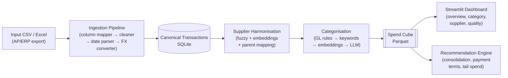

# SpendCube

## Overview

SpendCube is a production-grade procurement spend analytics pipeline that ingests messy AP/ERP exports, harmonises supplier names, categorises spend using UNSPSC, and produces a clean spend cube ready for diagnostic dashboards and recommendation narratives. It is designed for consulting and client diagnostic engagements where source data is always imperfect.

## Architecture



## Quick Start

```bash
# 1. Clone and install dependencies
git clone <repo> spendcube && cd spendcube
pip install -r requirements.txt

# 2. Place your AP export in data/input/
cp your_data.csv data/input/

# 3. Run the ingestion pipeline
make ingest

# 4. Run tests to verify everything works
make run-tests

# 5. Launch the dashboard
make serve-dashboard
```

## Installation

```bash
pip install -r requirements.txt
```

Or via the Makefile:

```bash
make install
```

## Configuration

All settings live in `config.yaml` at the project root. Key sections:

```yaml
paths:
  data_dir: data              # Root data directory
  db_path: data/db/spend_cube.db
  reference_dir: data/reference

llm:
  model: claude-sonnet-4-20250514
  dry_run: true               # DEFAULT: true — no LLM calls without explicit opt-in
  max_cost_usd: 10.0          # Hard cap on LLM spend per run
  api_key_env: ANTHROPIC_API_KEY

categorisation:
  confidence_high: 0.85       # Score >= 0.85 → HIGH band, no review needed
  confidence_medium: 0.60     # Score 0.60–0.85 → MEDIUM, spot-check
  llm_fallback_threshold: 0.60 # Below this → escalate to LLM

spend_cube:
  base_currency: AUD          # All amounts converted to this currency

column_mappings:
  DEFAULT:                    # Maps source column names to canonical field names
    VENDOR_NAME: raw_supplier_name
    AMT: original_amount
    CCY: original_currency
    # ... see config.yaml for full mapping
```

> **Note:** `dry_run: true` is the default. Set to `false` only when you have an `ANTHROPIC_API_KEY` set and want live LLM categorisation/recommendations.

## Usage

| Target | Command | Description |
|--------|---------|-------------|
| `install` | `make install` | Install Python dependencies |
| `generate-test-data` | `make generate-test-data` | Generate synthetic test dataset |
| `ingest` | `make ingest` | Run ingestion pipeline on `data/input/` |
| `harmonise` | `make harmonise` | Run supplier harmonisation |
| `categorise` | `make categorise` | Run spend categorisation |
| `build-cube` | `make build-cube` | Build spend cube Parquet output |
| `serve-dashboard` | `make serve-dashboard` | Launch Streamlit dashboard |
| `run-tests` | `make run-tests` | Run full test suite with coverage |
| `export` | `make export` | Export cube to CSV/Excel |

## Input Data Format

The pipeline expects a CSV or Excel file with (at minimum) supplier, amount, currency, date, and GL code columns. The `DEFAULT` column mapping covers this format:

| Column | Canonical Field | Example Values |
|--------|----------------|----------------|
| `VENDOR_NAME` | `raw_supplier_name` | `Acme Pty Ltd`, `ACME PTY LIMITED`, `acme p/l` |
| `VENDOR_NUM` | `raw_supplier_id` | `V-001`, `V-002` |
| `INV_NO` | `invoice_number` | `INV-2024-001`, `CN-2024-001` |
| `INV_DATE` | `invoice_date` | `15/03/2024`, `2024-03-18`, `20-Mar-2024` |
| `LINE_DESC` | `raw_line_description` | `Professional services` |
| `AMT` | `original_amount` | `1250.00`, `-850.00` (credit notes) |
| `CCY` | `original_currency` | `AUD`, `USD` |
| `GL_CODE` | `gl_account` | `6420100`, `642010` |
| `COST_CTR` | `cost_centre` | `CC-MKT-01`, `MKT01` |
| `PAY_TERMS` | `raw_payment_terms` | `Net 30`, `NET30`, `Net 60` |
| `PO_NUM` | `po_number` | `PO-9001` (blank = no PO) |
| `BUS_UNIT` | `business_unit` | `Corporate`, `Operations` |
| `SITE` | `plant_site` | `Sydney`, `Melbourne` |

Custom column layouts can be added as named mappings under `column_mappings:` in `config.yaml`.

## Pipeline Stages

| Stage | Module | Description |
|-------|--------|-------------|
| Column Mapping | `src/ingestion/column_mapper.py` | Renames source columns to canonical names using YAML-driven mappings |
| Data Cleaning | `src/ingestion/cleaner.py` | Trims whitespace, normalises nulls, detects intercompany/tax/credit flags |
| Date Parsing | `src/ingestion/date_parser.py` | Multi-format parser: DD/MM/YYYY → YYYY-MM-DD → DD-Mon-YYYY → M/D/YYYY → dateutil |
| FX Conversion | `src/ingestion/currency_converter.py` | Looks up monthly FX rates and converts all amounts to base currency (AUD) |
| Ingestion | `src/ingestion/ingest.py` | Orchestrates the pipeline; assigns UUIDs, timestamps, stores raw JSON |
| Supplier Harmonisation | `src/suppliers/harmoniser.py` | Fuzzy + embedding matching → canonical supplier master |
| Categorisation | `src/categorisation/categoriser.py` | GL rules → keyword → embeddings → LLM fallback; produces UNSPSC codes + confidence scores |
| Cube Builder | `src/cube/builder.py` | Aggregates canonical transactions into spend cube Parquet |
| Recommendation Engine | `src/recommendations/engine.py` | Detects consolidation, tail spend, and working capital opportunities |

## Development

```bash
# Generate a synthetic dataset for testing (100 rows with deliberate data quality issues)
make generate-test-data

# Run full test suite with coverage
make run-tests

# Run a specific test file
pytest tests/test_ingestion.py -v

# Run with coverage report
pytest tests/ --cov=src --cov-report=term-missing
```

## Phased Build Plan

| Phase | Description | Status |
|-------|-------------|--------|
| **Phase 1** | Foundation: ingestion pipeline, canonical schema, SQLite, reference data, unit tests | **In Progress** |
| **Phase 2** | Supplier harmonisation: name normalisation, fuzzy matching, entity resolution, parent mapping | Planned |
| **Phase 3** | Spend categorisation: GL rules, keyword matching, embedding classifier, LLM fallback | Planned |
| **Phase 4** | Spend cube construction: aggregation, Parquet output, data quality diagnostics | Planned |
| **Phase 5** | Streamlit dashboards: spend overview, category, supplier, payment terms, quality | Planned |
| **Phase 6** | Recommendation engine + review workstation: narratives, consolidation, WC analysis | Planned |

## License

MIT
